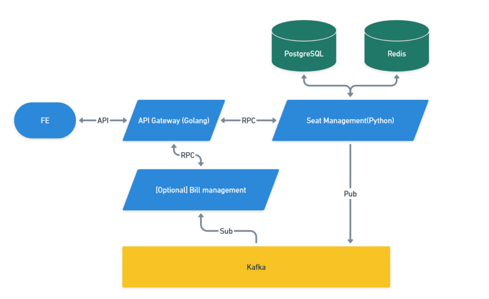

# Vulkan Manhattan distance
### Project for reserving seats based on Manhattan distance

##  Table of Contents
- [Introduction](#introduction)
- [Features](#assumptions-and-features)
- [Tech Stack](#tech-stack)
- [Usage](#usage)
- [Installation](#installation)
- [Running Tests](#running-tests)

## Introduction
An application designed to manage rooms, as well as reserve and cancel seat bookings

## Assumptions and features
### Assumptions
- Rooms (with columns and rows) can be set up via API calls
- The minimum distance, based on Manhattan distance, can be configured through settings
- By default, the minimum distance is accepted (i.e., distance ≥ minimum distance)

### Features
- Room management: Create (with row, col), Retrieve, Remove
- Seat management: Retrieve (available and already reverse in room), Reverse, Cancel

## Tech Stack
- The system is built using a microservices architecture for enhanced scalability and flexibility. This approach allows for easier future scaling and the ability to change service techniques as needed. The architecture is divided into two main services:
    - **API Gateway (Golang)**: Chosen for its excellent performance and speed.
    - **Room Management (Python)**: Selected for its robust support of various computing operations (e.g., list, set, union, join).

- **Database**: PostgreSQL
- **Cache**: Redis
- [Optional] **Event-Driven System**: Kafka



## Installation
### 1. Ensure that you have docker and docker-compose installed
### 2. Start
Run docker-compose with automatic build
``` bash
docker-compose -f ./docker_compose.yml up --build
```

## Running Tests
``` bash
docker-compose -f ./docker_compose.yml exec room_management_svc pytest tests -vv
```

## Usage
### 1. Utility
- Check health
``` bash
curl -X GET http://localhost:8080/ping
```
Example response:
```json
{"message":"pong"}
```
### 2. Rooms
- Retrieving a list of rooms
``` bash
curl -X GET http://localhost:8080/rooms
```
Example response:
```json
{
  "rooms": [
    {
      "id": 1,
      "row": 4,
      "col": 4
    },
    {
      "id": 2,
      "row": 10,
      "col": 20
    }
  ]
}
```
- Create a new room
``` bash
curl -X POST -d '{"row":4,"col":4}' http://localhost:8080/rooms
```
Example response:
``` json
{"status":"Room added","id":14}
```
- Retrieving single room
``` bash
curl -X GET http://localhost:8080/rooms/14
```
Example response:
```
{
  "room": {
    "id": 14,
    "row": 4,
    "col": 4
  }
}
```
- Get all available seats in room
``` bash
curl -X GET http://localhost:8080/rooms/14/seats/available
```
Example response:
``` json
{"seats":[{"pos_x":0,"pos_y":0},{"pos_x":0,"pos_y":1},{"pos_x":0,"pos_y":2},{"pos_x":0,"pos_y":3},{"pos_x":1,"pos_y":0},{"pos_x":1,"pos_y":1},{"pos_x":1,"pos_y":2},{"pos_x":1,"pos_y":3},{"pos_x":2,"pos_y":0},{"pos_x":2,"pos_y":1},{"pos_x":2,"pos_y":2},{"pos_x":2,"pos_y":3},{"pos_x":3,"pos_y":0},{"pos_x":3,"pos_y":1},{"pos_x":3,"pos_y":2},{"pos_x":3,"pos_y":3}]}
```
- Reverse seats
``` bash
curl -X POST -d '{"seats":[{"pos_x":0,"pos_y":1},{"pos_x":0,"pos_y":0}]}' http://localhost:8080/rooms/14/seats/reserve
```
Example response:
``` json
{
  "seats": [
    {
      "pos_x": 0,
      "pos_y": 1
    },
    {
      "pos_x": 0,
      "pos_y": 0
    }
  ]
}
```
- Get all reversed seats
``` bash
curl -X GET http://localhost:8080/rooms/14/seats
```
Example response:
``` json
{
  "seats": [
    {
      "id": 56,
      "pos_x": 0,
      "pos_y": 1
    },
    {
      "id": 57,
      "pos_x": 0,
      "pos_y": 0
    }
  ]
}
```
- Get all available seats in room
``` bash
curl -X GET http://localhost:8080/rooms/14/seats/available
```
Example response:
``` json
{
  "seats": [
    {
      "pos_x": 3,
      "pos_y": 3
    }
  ]
}
```
- Cancel seats
``` bash
curl -X DELETE -d '{"seat_ids":[56]}' http://localhost:8080/rooms/14/seats/cancel
```
Example response:
``` json
{"status":"Seats are canceled"}
```
- Get all available seats in room
``` bash
curl -X GET http://localhost:8080/rooms/14/seats/available
```
Example response:
``` json
{
  "seats": [
    {
      "pos_x": 2,
      "pos_y": 3
    },
    {
      "pos_x": 3,
      "pos_y": 2
    },
    {
      "pos_x": 3,
      "pos_y": 3
    }
  ]
}
```
