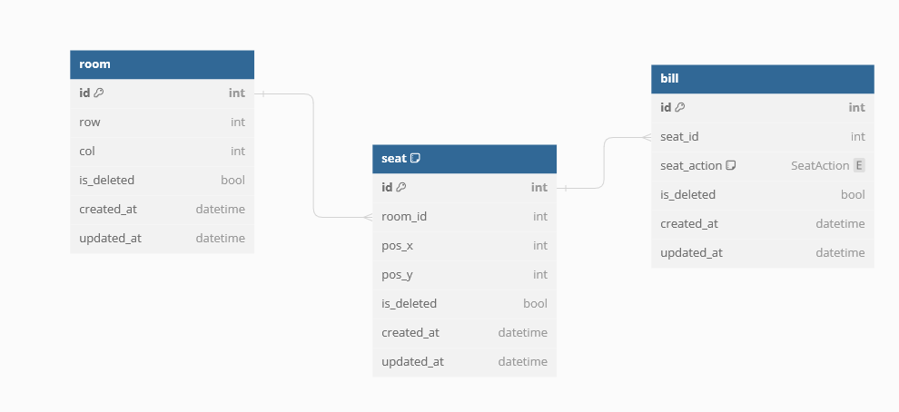

# Room Management Services
### Service for reserving seats based on Manhattan distance

##  Table of Contents
- [Tree](#tree)
- [Tech Stack](#tech-stack)
- [Main Functions](#main-functions)

- [Todo](#todo)

## Tree
```
Room Management Services
├───Migrations --> migration files
├───src
│   ├───adapters --> Adapter to map API and internal interfaces
│   ├───entities --> Model
│   ├───protos --> Proto files
│   ├───proto_generated --> Generated proto files
│   ├───repositories --> Storage
│   ├───servivces --> Utility services
│   └───use_cases --> Applying business logic
├───config.py --> Load dot env to settings
├───main.py --> Main
├───yoyo_migration.py --> Seeder
└───tests --> Tests
```

## Tech Stack
- Language: Python
- RPC protocol framework: gRPC
- Migration: yoyo-migrations
- Cache: Redis
- Database: PostgreSQL

## Database design
- room
- seat: Only store reversed seats



## Main Functions
### 1. Init Mahanta distance
- Idea will be
    - If room dont have any seat --> Return all available
    - If room full (len(seats) == row * col) --> Return empty
    - Loop for all seats allready taken from rooms
        - Get all available seats with seat taken
        - Inner join all list available seats
        - Return available seats

- Simple Mahata version with Python --> Time complexity is ***O(row\*col)***
``` python
def manhattan_distance(x:int, y:int, min_distance:int, max_rows:int, max_cols:int):
    points = []
    
    for i in range(max_rows): # O(row)
        for j in range(max_cols): # O(col)
            distance = abs(x - i) + abs(y - j)
            if distance >= min_distance:
                points.append((i, j))
    
    return points
```
- Code in */src/use_cases/room_management.py* : manhattan_distance --> Time complexity is ***O(row)***
``` python
def get_available_per_taken_seat(
    self,
    room: Room,
    min_distance: int,
    seat_pos_x: int,
    seat_pos_y: int,
    cur_position_seats: List[Tuple[int, int]],
) -> List[Tuple[int, int]]:
    available_seats: List[Tuple[int, int]] = []

    for pos_x in range(room.row): # O(row)
        # |pos_x - seat_x| + |pos_y - seat_y| = min_distance
        # Calculate abs_x
        abs_x: int = abs(seat_pos_x - pos_x)

        # If abs_x is greater than or equal to min_distance, all seats are available
        if abs_x >= min_distance:
            available_seats += list(
                set([(pos_x, y) for y in range(room.col)]) - set(cur_position_seats)
            )
            continue

        # Calculate pos_y_min and pos_y_max
        abs_y: int = min_distance - abs_x
        pos_y_min: int = seat_pos_y - abs_y
        pos_y_max: int = seat_pos_y + abs_y

        # pos_y <= pos_y_min so if pos_y_min >= 0 and pos_y_min < self._room.col, pos_y = [0,pos_y_min+1]
        if pos_y_min >= 0 and pos_y_min < room.col:
            available_seats += list(
                set([(pos_x, pos_y) for pos_y in range(0, pos_y_min + 1)])
                - set(cur_position_seats)
            )

        # pos_y >= pos_y_max so if pos_y_max >= 0 and pos_y_max < self._room.col, pos_y = [pos_y_max, self._room.col]
        if pos_y_max >= 0 and pos_y_max < room.col:
            available_seats += list(
                set([(pos_x, pos_y) for pos_y in range(pos_y_max, room.col)])
                - set(cur_position_seats)
            )

    # Remove duplicate and remove existing seats
    available_seats = list(set(available_seats))
    return available_seats
```

### 2. Use Lock-row to prevent data races
Code in ***repositories/seat_repository.py***
``` python
with get_db_connection() as conn:
    cursor = conn.cursor()
    for seat in seats:
        # Lock row ---> Select for update
        cursor.execute(
            "SELECT id FROM seat WHERE room_id = %s AND pos_x = %s AND pos_y = %s FOR UPDATE",
            (room_id, seat.pos_x, seat.pos_y),
        )

        cursor.execute(
            "DELETE FROM seat WHERE room_id = %s AND pos_x = %s AND pos_y = %s",
            (room_id, seat.pos_x, seat.pos_y),
        )
    conn.commit()
    cursor.close()
```

### 3. Redis
- Using Redis for caching - Code in ***repositories/room_repository.py***
``` python
def get_room(self, room_id: int) -> Optional[Room]:
    # Try to get room from cache
    cache_key = f"room_{room_id}"
    cached_room = self.redis_client.get(cache_key)
    if cached_room:
        return Room.model_validate_json(cached_room)

    with get_db_connection() as conn:
        cursor = conn.cursor()
        cursor.execute(
            "SELECT id, row, col, is_deleted FROM room WHERE id = %s AND is_deleted = FALSE",
            (room_id,),
        )
        room_data = cursor.fetchone()
        cursor.close()
        if room_data is None:
            return None
        cached_room = Room(
            id=room_data[0],
            row=room_data[1],
            col=room_data[2],
            is_deleted=room_data[3],
        )

        self.redis_client.set(
            cache_key, cached_room.model_dump_json(), ex=settings.redis_key_ttl
        )

        return cached_room

def remove_room(self, room_id: int):
    # Invalidate cache when a new room is added
    self.redis_client.client.delete("rooms_cache")
    self.redis_client.client.delete(f"room_{room_id}")

    with get_db_connection() as conn:
        cursor = conn.cursor()
        cursor.execute(
            "UPDATE room SET is_deleted = TRUE WHERE id = %s", (room_id,)
        )
        conn.commit()
        cursor.close()
```
- Using DLM Redis to prevent resource racing from multiple replica - Code in ***use_cases/room_management.py***
``` python
def get_available_per_taken_seat(
    self,
    room: Room,
    min_distance: int,
    seat_pos_x: int,
    seat_pos_y: int,
    cur_position_seats: List[Tuple[int, int]],
) -> List[Tuple[int, int]]:
    available_seats: List[Tuple[int, int]] = []

    for pos_x in range(room.row):
        # |pos_x - seat_x| + |pos_y - seat_y| = min_distance
        # Calculate abs_x
        abs_x: int = abs(seat_pos_x - pos_x)

        # If abs_x is greater than or equal to min_distance, all seats are available
        if abs_x >= min_distance:
            available_seats += list(
                set([(pos_x, y) for y in range(room.col)]) - set(cur_position_seats)
            )
            continue

        # Calculate pos_y_min and pos_y_max
        abs_y: int = min_distance - abs_x
        pos_y_min: int = seat_pos_y - abs_y
        pos_y_max: int = seat_pos_y + abs_y

        # pos_y <= pos_y_min so if pos_y_min >= 0 and pos_y_min < self._room.col, pos_y = [0,pos_y_min+1]
        if pos_y_min >= 0 and pos_y_min < room.col:
            available_seats += list(
                set([(pos_x, pos_y) for pos_y in range(0, pos_y_min + 1)])
                - set(cur_position_seats)
            )

        # pos_y >= pos_y_max so if pos_y_max >= 0 and pos_y_max < self._room.col, pos_y = [pos_y_max, self._room.col]
        if pos_y_max >= 0 and pos_y_max < room.col:
            available_seats += list(
                set([(pos_x, pos_y) for pos_y in range(pos_y_max, room.col)])
                - set(cur_position_seats)
            )

    # Remove duplicate and remove existing seats
    available_seats = list(set(available_seats))
    return available_seats
```

## Todo:
- Integrate with Kafka if scaling later
